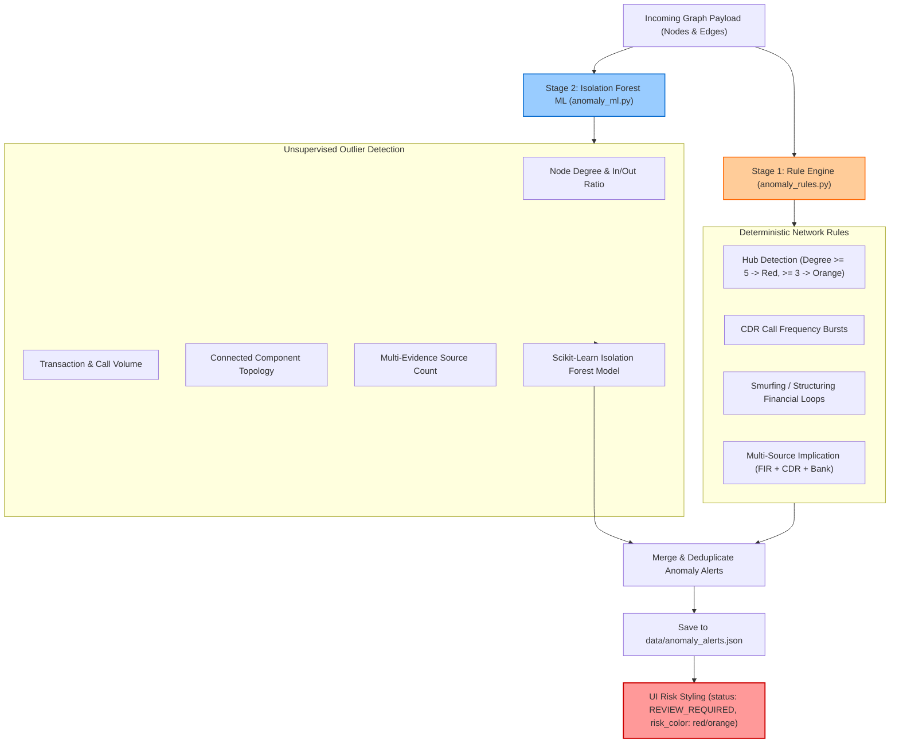

# Anomaly & Suspicious Subnetwork Detection

VERITAS employs a two-stage anomaly detection architecture to highlight high-risk nodes, suspicious financial loops, and covert criminal communication hubs.

## Engine Implementation

Source Code: [`ml/anomaly/anomaly_rules.py`](file:///d:/SIH2026/ml/anomaly/anomaly_rules.py), [`ml/anomaly/anomaly_ml.py`](file:///d:/SIH2026/ml/anomaly/anomaly_ml.py), [`backend/app/api/anomaly.py`](file:///d:/SIH2026/backend/app/api/anomaly.py)

## Stage 1: Rule-Based Network Engine (`anomaly_rules.py`)

The rule engine evaluates deterministic criminal network patterns:
- **High Degree / Hub Detection**: Flags entities with total connection degree $\ge 5$ (high-risk red) or $\ge 3$ (orange).
- **Rapid CDR Burst**: Flags phone numbers with unusually high call frequencies within short temporal windows.
- **Structuring / Smurfing Financial Loops**: Detects accounts engaging in split financial transactions (`TRANSFERRED_TO`) designed to evade banking thresholds.
- **Multi-Evidence Implication**: Flags entities that appear across $\ge 2$ distinct evidence document types (e.g., named in both an FIR and a CDR log).

## Stage 2: Isolation Forest ML Engine (`anomaly_ml.py`)

The ML engine constructs numerical feature vectors for each graph node:
- **Node Degree & In/Out Ratio**
- **Total Transaction / Call Volume**
- **Connected Component Size**
- **Multi-Source Evidence Count**

An **Isolation Forest** model (`scikit-learn`) scores nodes based on isolation depth. Nodes falling beyond the anomaly threshold are flagged as structural outliers.

## Persistence & UI Indicators

Anomalies are persisted to `data/anomaly_alerts.json` and served via `GET /api/anomalies` and `GET /api/cases/{case_id}/anomalies`. Flagged nodes receive:
- `status`: `"REVIEW_REQUIRED"`
- `risk_color`: `"red"` or `"orange"`
- `anomaly_reasons`: Detailed human-interpretable reasoning strings appended to the node UI drawer.
