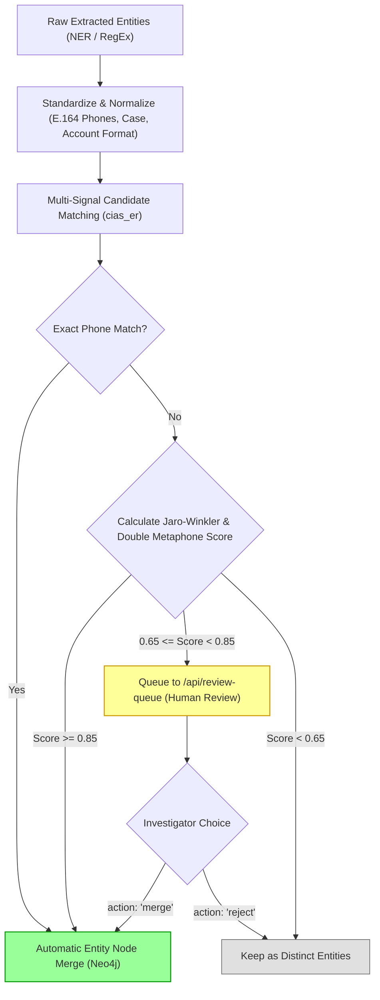

# Multi-Signal Entity Resolution & Disambiguation

Entity Resolution (ER) merges duplicate mentions of the same real-world entity across disparate evidence files while routing ambiguous candidate matches to human investigators.

## Implementation Architecture

Source Code: [`backend/app/ingestion/resolver.py`](file:///d:/SIH2026/backend/app/ingestion/resolver.py), [`cias_er/`](file:///d:/SIH2026/cias_er/)

## Resolution Signals & Scoring

1. **Phone Standardization**: All phone numbers are converted to normalized E.164 strings (`+91XXXXXXXXXX`). Matching phones across different FIRs or CDRs are merged automatically.
2. **Phonetic Encoding**: Names are encoded using Double Metaphone and Soundex via `cias_er/matcher.py`. This resolves phonetic misspellings across police stations (e.g., "Faisal Khan" vs. "Faizal Cahn").
3. **Fuzzy String Distance**: Jaro-Winkler distance is computed across candidate name strings using `RapidFuzz`.
4. **Case-Scoped Isolation**: Candidate comparisons are filtered by `case_id` to prevent inadvertent cross-case merging unless cross-case analysis is explicitly invoked.

## Human-in-the-Loop Review Queue

Ambiguous identity matches (e.g., phonetic similarity score between 0.65 and 0.85) are not merged automatically. Instead:
- Items are appended to `needs_review` inside `data/entity_registry.json`.
- Investigators view these items via `GET /api/review-queue`.
- Resolving an item via `POST /api/review-queue/{review_id}/resolve` with action `"merge"` triggers an automated Cypher node merge in Neo4j (`merge_nodes_in_neo4j`).
