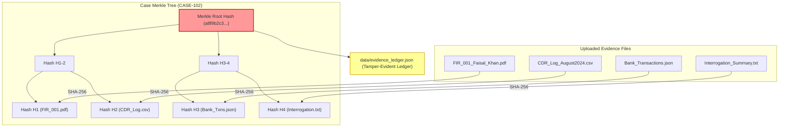

# Cryptographic Evidence Integrity & Merkle Ledger

The VERITAS Evidence Integrity module guarantees court-admissible chain-of-custody for all evidence files uploaded to the platform.

Source Code: [`blockchain/client/fabric_client.py`](file:///d:/SIH2026/blockchain/client/fabric_client.py), [`blockchain/hashing/sha256.py`](file:///d:/SIH2026/blockchain/hashing/sha256.py), [`blockchain/hashing/merkle_tree.py`](file:///d:/SIH2026/blockchain/hashing/merkle_tree.py)

## Cryptographic Architecture

## Module Component Breakdown

### 1. SHA-256 Checksum Engine (`blockchain/hashing/sha256.py`)
Computes deterministic 256-bit hash digests for both binary file streams (`compute_bytes_sha256`) and filesystem paths (`compute_file_sha256`).

### 2. Merkle Tree Builder (`blockchain/hashing/merkle_tree.py`)
Constructs a binary Merkle Tree from the array of file hashes belonging to a case:
- Leaf nodes contain individual SHA-256 file hashes.
- Non-leaf nodes contain the hash of combined child hashes.
- The **Merkle Root Hash** uniquely summarizes all evidence files in the case. If even a single byte in any evidence file is modified, the resulting Merkle Root Hash changes completely.

### 3. Ledger Client (`blockchain/client/fabric_client.py`)
Maintains an immutable evidence ledger (`data/evidence_ledger.json`) storing:
- `record_id` (e.g. `EV-E3B0C442`)
- `file_name` & `case_id`
- `file_sha256` checksum
- `merkle_root` hash
- `timestamp` (ISO 8601 UTC)
- `status`: `"VERIFIED_TAMPER_EVIDENT"`

## Verification Endpoints & UI Display

- `GET /api/evidence/ledger`: Exposes full ledger history for audit inspections.
- `POST /api/evidence/verify`: Accepts `file_name` and `file_hash`, returning `MATCH_CONFIRMED` or `CHECKSUM_MISMATCH_POSSIBLE_TAMPERING`.
- `GET /api/evidence/{case_id}/integrity`: Fetches current Merkle Root and registered evidence list for a case.

> **Implementation Note / Audit Confirmation**:
> The client class is named `BlockchainIntegrityClient` inside `fabric_client.py`. In the current codebase, it operates as a local cryptographic SHA-256 and Merkle Tree ledger client. Integration with a live multi-node Hyperledger Fabric peer cluster is scaffolded under `blockchain/fabric/` as a planned enterprise extension.
