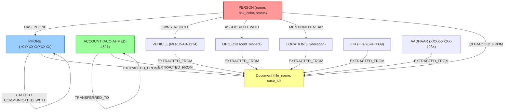

# Neo4j Graph Database Schema & Ontology

VERITAS stores entity networks in Neo4j using a labeled property graph model. Every entity node and relationship edge contains metadata and evidence provenance.

Source Code: [`GRAPH_SCHEMA.md`](file:///d:/SIH2026/GRAPH_SCHEMA.md), [`backend/app/database/neo4j.py`](file:///d:/SIH2026/backend/app/database/neo4j.py)

---

## 0. Graph Ontology Diagram (Mermaid)



## 1. Node Labels & Properties


Nodes represent real-world criminal intelligence entities. Merging is performed on property `id`.

### Node Ontology

| Node Label | ID Prefix Format | Value Field Example | Key Node Properties |
|---|---|---|---|
| **`PERSON`** | `person:<hash>` | `"Faisal Khan"` | `id`, `value`, `type`, `confidence`, `aliases`, `source_files`, `status`, `risk_color`, `historical_firs`, `phone`, `anomaly_reasons`, `evidence_trail`, `flagged` |
| **`PHONE`** | `phone:<hash>` | `"+919876543210"` | `id`, `value`, `type`, `confidence`, `source_files` |
| **`VEHICLE`** | `vehicle:<hash>` | `"MH-12-AB-1234"` | `id`, `value`, `type`, `confidence`, `source_files` |
| **`LOCATION`** | `location:<hash>`| `"Hyderabad"` | `id`, `value`, `type`, `confidence`, `source_files` |
| **`ACCOUNT`** | `account:<hash>` | `"ACC-AHMED-4521"` | `id`, `value`, `type`, `confidence`, `source_files` |
| **`ORG`** | `org:<hash>` | `"Crescent Traders"` | `id`, `value`, `type`, `confidence`, `source_files` |
| **`FIR`** | `fir:<hash>` | `"FIR-2024-0089"` | `id`, `value`, `type`, `confidence`, `source_files` |
| **`AADHAAR`** | `aadhaar:<hash>` | `"XXXX-XXXX-1234"` | `id`, `value`, `type`, `confidence`, `sha256_hash` |
| **`Document`**| N/A | `"FIR_001.pdf"` | `file_name`, `case_id` |

---

## 2. Relationship Types

Edges represent communication, financial, physical, or logical interactions between entities.

| Relationship Type | Source Label | Target Label | Edge Properties | Description |
|---|---|---|---|---|
| **`EXTRACTED_FROM`** | `ANY_ENTITY` | `Document` | None | Provenance link connecting an entity to its originating document |
| **`CALLED`** | `PHONE` | `PHONE` | `confidence`, `status`, `evidence`, `timestamp`, `duration`, `location` | Call detail record (CDR) connection |
| **`TRANSFERRED_TO`**| `ACCOUNT` | `ACCOUNT` | `confidence`, `status`, `evidence`, `amount`, `timestamp` | Financial transaction between accounts |
| **`HAS_PHONE`** | `PERSON` | `PHONE` | `confidence`, `status`, `evidence` | Association between a person and phone number |
| **`OWNS_VEHICLE`** | `PERSON` | `VEHICLE` | `confidence`, `status`, `evidence` | Ownership or operation of a vehicle |
| **`ASSOCIATED_WITH`**| `PERSON` | `ORG` | `confidence`, `status`, `evidence` | Link between a suspect and organization |
| **`MENTIONED_NEAR`** | `PERSON` | `LOCATION` | `confidence`, `status`, `evidence` | Co-occurrence of a person and location |
| **`COMMUNICATED_WITH`**|`PHONE` | `PHONE` | `confidence`, `status`, `evidence` | Communication inferred from text narratives |
| **`MENTIONED_IN`** | `ANY_ENTITY` | `FIR` | `confidence`, `status`, `evidence` | Explicit reference of entity inside an FIR |
| **`<VERB_TRIGGER>`**| `ANY_ENTITY` | `ANY_ENTITY` | `confidence`, `status`, `evidence`, `trigger_verb` | Dynamic verb relationship (e.g. `MET`, `PAID`) |

---

## 3. Database Constraints & Indexes

Initialized on backend startup via `init_neo4j_schema()` in `backend/app/database/neo4j.py`:

```cypher
CREATE CONSTRAINT person_id_unique IF NOT EXISTS FOR (n:PERSON) REQUIRE n.id IS UNIQUE;
CREATE CONSTRAINT phone_id_unique IF NOT EXISTS FOR (n:PHONE) REQUIRE n.id IS UNIQUE;
CREATE CONSTRAINT vehicle_id_unique IF NOT EXISTS FOR (n:VEHICLE) REQUIRE n.id IS UNIQUE;
CREATE CONSTRAINT location_id_unique IF NOT EXISTS FOR (n:LOCATION) REQUIRE n.id IS UNIQUE;
CREATE CONSTRAINT account_id_unique IF NOT EXISTS FOR (n:ACCOUNT) REQUIRE n.id IS UNIQUE;
CREATE CONSTRAINT org_id_unique IF NOT EXISTS FOR (n:ORG) REQUIRE n.id IS UNIQUE;
CREATE CONSTRAINT document_unique IF NOT EXISTS FOR (d:Document) REQUIRE (d.file_name, d.case_id) IS UNIQUE;

CREATE INDEX person_value_index IF NOT EXISTS FOR (n:PERSON) ON (n.value);
CREATE INDEX phone_value_index IF NOT EXISTS FOR (n:PHONE) ON (n.value);
```
