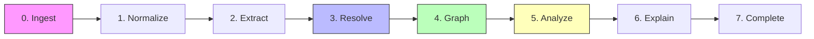
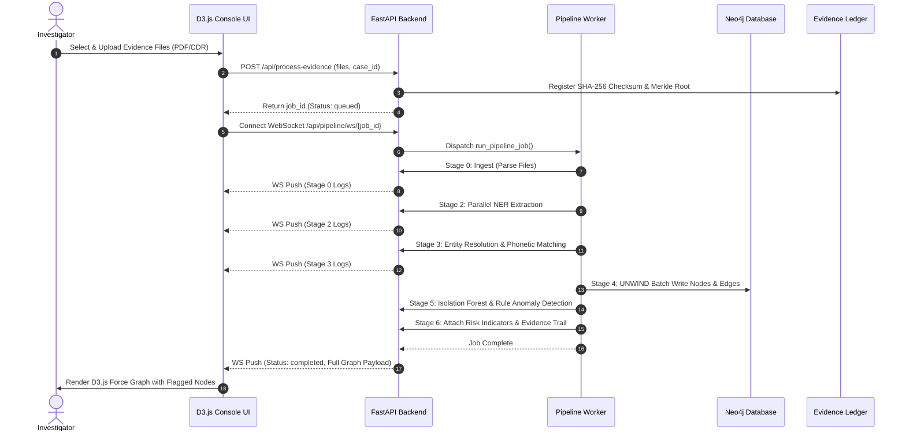

# Visual Diagrams: 7-Stage Pipeline & Data Flow

This file contains Mermaid sequence diagrams and pipeline flowcharts for the 7-stage evidence processing engine in VERITAS.

## 1. 7-Stage Processing Pipeline Flowchart (Mermaid)

## 2. Asynchronous Ingestion & WebSocket Execution Sequence (Mermaid)

## 3. Static Image References

- **Data Flow Diagram Image**: 
- **Knowledge Graph Diagram Image**: 
