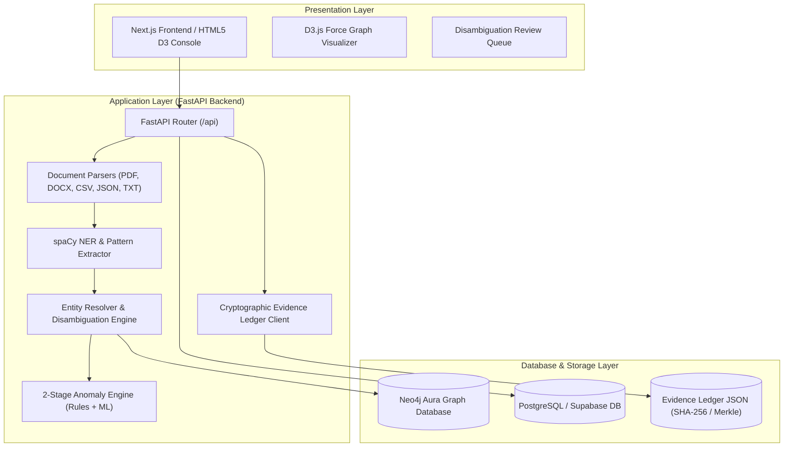

# Visual Diagrams: System Architecture

This file contains Mermaid diagram definitions and references to static architecture diagrams stored in `docs/diagrams/`.

## 1. System Topology Flowchart (Mermaid)

## 2. Static Diagram References

- **Architecture Diagram Image**: 
- **Deployment Topology Image**: 
