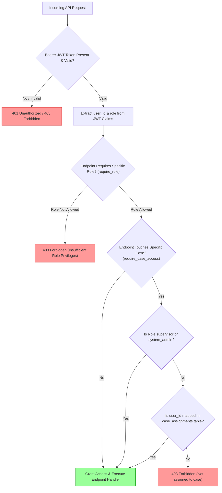

# Role-Based Access Control (RBAC) & Attribute Access (ABAC)

VERITAS implements multi-layered access control combining Role-Based Access Control (RBAC) and Attribute-Based Access Control (ABAC) to enforce case data isolation.

Source Code: [`backend/app/auth/rbac.py`](file:///d:/SIH2026/backend/app/auth/rbac.py), [`backend/app/auth/abac.py`](file:///d:/SIH2026/backend/app/auth/abac.py)

---

## 0. Authorization Decision Flowchart (Mermaid)



## 1. System Roles & Matrix (RBAC)


User roles are assigned in PostgreSQL (`users.role`) and embedded into signed OAuth2 JWT claims (`"role": "investigator"`).

| Endpoint Group | `investigator` | `supervisor` | `system_admin` | Implementation Guard |
|---|---|---|---|---|
| `POST /api/process-evidence` | ✅ Allowed | ✅ Allowed | ✅ Allowed | `Depends(get_current_user)` |
| `POST /api/cases` | ✅ Allowed | ✅ Allowed | ✅ Allowed | `require_role("investigator", "supervisor", "system_admin")` |
| `POST /api/cases/{case_id}/assign` | ❌ Denied | ✅ Allowed | ❌ Denied | `require_role("supervisor")` |
| `POST /api/review-queue/{id}/resolve` | ✅ Allowed | ✅ Allowed | ✅ Allowed | `require_role("investigator", "supervisor", "system_admin")` |
| `GET /api/cases/{case_id}/graph` | ✅ (Assigned) | ✅ Allowed | ✅ Allowed | `require_case_access` |

---

## 2. Case Assignment Isolation (ABAC)

Case isolation is enforced dynamically by `require_case_access` in `backend/app/auth/abac.py`:

```python
def require_case_access(case_id: str, user: User = Depends(get_current_user), db: Session = Depends(get_db)):
    if user.role in ("supervisor", "system_admin"):
        return case_id
    if not is_user_assigned(db, user.id, case_id):
        raise forbidden(f"Not assigned to case {case_id}")
    return case_id
```

- Investigators cannot read, query, or view graph networks for cases unless an explicit mapping exists in `case_assignments`.
- Supervisors and System Admins bypass individual case assignments to permit oversight and auditing across all team cases.
